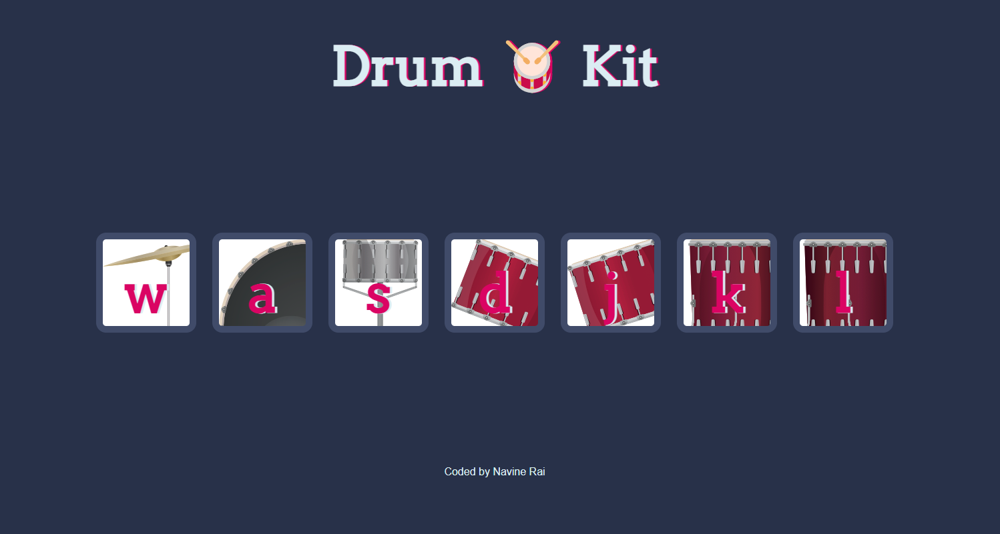

# Drum Kit - based on a Udemy Course on web development

## Table of contents

- [Overview](#overview)
  - [The challenge](#the-challenge)
  - [Screenshot](#screenshot)
  - [Links](#links)
- [My process](#my-process)
  - [Built with](#built-with)
  - [What I learned](#what-i-learned)
  - [Continued development](#continued-development)
  - [Useful resources](#useful-resources)
- [Author](#author)

## Overview

### The challenge

Users should be able to:

- press a key on their keyboard corresponding to any of the keys displayed on the drums and hear an appropriate sound.
- click on a drum and hear the approrpriate sound

### Screenshot

### Links

- Solution URL: [Source Code](https://github.com/rainSax/Drum-Kit)
- Live Site URL: [Live Site](https://rainsax.github.io/Drum-Kit/)

## My process

### Built with

- javascript

### What I learned

- use of javascript switch case statements
- javascript functions and function callbacks
- use of setTimeout to create a delay
- creating and playing an Audio element

### Continued development

For continued development I would like to make the website responsive and create different views for mobile as well as tablet.

### Useful resources

- [MDN - setTimeout](https://developer.mozilla.org/en-US/docs/Web/API/setTimeout) - This site helped me understand how to create a delay in addition and removal of drum animation when clicked.

## Author

- Website - [Navine Rai](https://github.com/rainSax)
